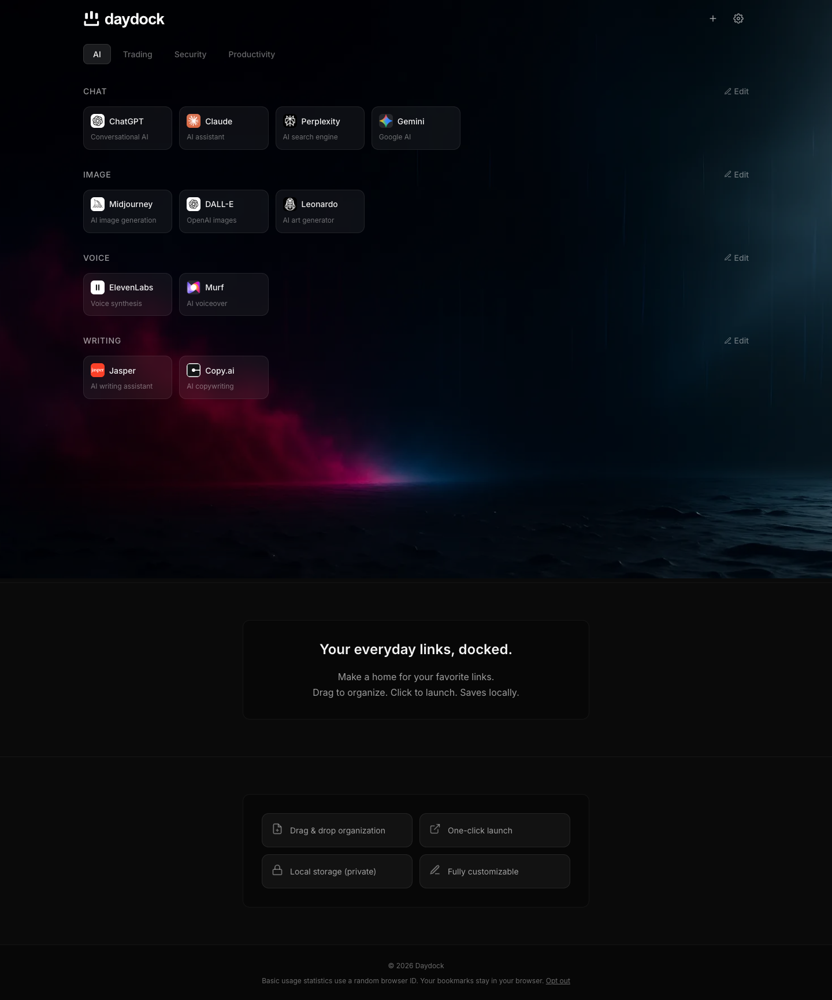

# Daydock

**Your everyday links, docked.**

A customizable dashboard for your everyday links. Organize bookmarks into
multiple dashboards, make them yours, and save your setup in your browser.
No account required.



## Features

- Multiple dashboards with grouped bookmarks
- Drag-and-drop organization and editing
- Custom backgrounds, including uploaded images
- JSON export and import for backups and moving between browsers
- Browser-local bookmark storage
- Optional server activity reports for people hosting an instance

## Run locally

Requires Node.js 24 and npm.

```sh
npm install
npm run dev
```

Open http://localhost:3109. For a production build:

```sh
npm run build
npm run preview -- --port 3109
```

## Deploy

```sh
docker compose up -d --build
```

The app is available on port 3000. Compose includes a persistent volume for
activity statistics. For a Dokploy Application built from the Dockerfile, mount
a persistent volume at `/app/data/activity` and set
`NUXT_ACTIVITY_DIR=/app/data/activity`.

Activity tracking is enabled by default in production and disabled in development.
Set `NUXT_PUBLIC_ACTIVITY_ENABLED=false` to disable it. The server stores its own
instance's counts; nothing is sent to a central Daydock analytics service.
[Activity documentation](ACTIVITY.md) covers reports, browser exclusion, the
recorded data, and storage configuration.

## Your data

Bookmarks, dashboard layouts, and uploaded backgrounds are saved in localStorage
in the current browser. They are not synced between devices. Clearing site data
or closing a private browsing session can remove them. Export each dashboard
through **Settings → Export** to keep a backup, and use **Settings → Import** to
restore it in another browser or on another domain.

Daydock uses its own browser storage keys. To move an existing dashboard from
another installation or domain, export each dashboard first, then import its
JSON file into Daydock. Renaming the JSON file is not necessary. Browsers isolate
storage by origin, so data does not automatically follow a domain change.

## Privacy

Dashboard contents stay in the browser. When activity tracking is enabled,
requests to your own server include a random browser ID, event type, and flags
for saved data and customization. Bookmark URLs and names are not included.
Explicit browser exclusion, Do Not Track, and Global Privacy Control are honored.

The app loads fonts from Google Fonts and requests favicons from Google's favicon
service using bookmark hostnames. Opening a bookmark navigates to that website.

## Development

Built with Nuxt 4, Vue 3, and TypeScript.

```sh
npm run build
node --test tests/activity.test.mjs
```

Tests cover activity collection, report formatting, customization detection,
browser preferences, saved data, and persistence across server restarts.
